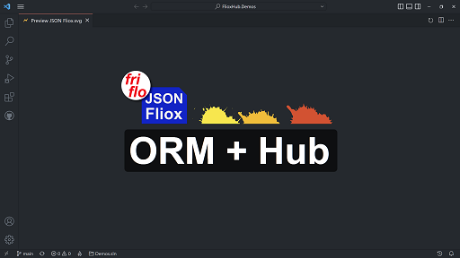

# [](https://github.com/friflo/FlioxHub.Demos)    **FlioxHub Demos**  

[](https://github.com/friflo/FlioxHub.Demos/actions)


This project contains two **ready to run** examples showing how to create and use
[**JSON Fliox**](https://github.com/friflo/Friflo.Json.Fliox/blob/main/README.md) **Clients** & **Hubs**.  

*In short*  
**JSON Fliox** is .NET library supporting simple and efficient access to NoSQL databases via C# or Web clients.

Demos on GitHub: [friflo/FlioxHub.Demos](https://github.com/friflo/FlioxHub.Demos)

## Content

- [Examples](#examples)
    - [Demo](#demo)
    - [Todo](#todo)
- [Features](#features)
- [Database provider](#database-provider)
- [Build](#build)


# Examples

The examples have a different set of features. Their features are listed [below](#features).  
The intention is to guide how to add a new or remove an existing features in an application.

- [**Demo**](#demo)    *common* example  - LOC: 560
- [**Todo**](#todo)    *minimal* example - LOC:  70

Each example contains three folders / C# projects

| folder     | project type      | description               | run command                                           |
|------------|-------------------|---------------------------|-------------------------------------------------------|
| **Client** | .NET library      | database client / schema  |                                                       |
| **Hub**    | .NET HTTP server  | bootstrapping a Hub       | `dotnet run`                                          |
| **Test**   | NUnit tests       | client examples & test DB | `dotnet test` <br/> `dotnet run [http, file, memory]` |


The following video demonstrates a Walkthrough of the examples.

[](https://www.youtube.com/watch?v=aAhQYupFkb0 "Demos Walkthrough")

The **API**'s used by the examples are available at [**fliox-docs API Reference**](https://github.com/friflo/fliox-docs)

Build, Test and Run instructions described ad the [Build](#build) section

## **Demo**
📄   [README.md](Demo/Client/README.md)

The Demo example contains a *common* **Client**, a *common* **Hub** and **unit tests**.  
**Hub** features:  
All **Todo/Hub** features + **ASP.NET Core** integration, **GraphQL** API, monitoring, user authorization, **Pub-Sub**, container **relations** and custom **commands**.  
It utilize [Bogus](https://github.com/bchavez/Bogus) to generate fake records in various containers
and uses [GraphQLParser](https://github.com/graphql-dotnet/parser) to support GraphQL.

Use the Hub Explorer http://localhost:8010/fliox/ to check the features.  
Try out the online example [**DemoHub on AWS**](http://ec2-174-129-178-18.compute-1.amazonaws.com/) - *EC2: t2-micro*, *us-east-1*  

|              | Client                       | Hub                                                                    |
|--------------|------------------------------|------------------------------------------------------------------------|
| C#           | 2 files - LOC 130            | 4 files - LOC bootstrap 80, ASP.NET Core 70, domain examples 280       |
| dependencies | **JSON Fliox** 4 dlls 850 KB | **JSON Fliox** 7 dlls 900 KB  **GraphQLParser** 300kb  **Bogus** 2.4MB |


## **Todo**
📄   [README.md](Todo/Client/README.md)

The Todo example contains a *minimal* **Client**, a *minimal* **Hub** and **unit tests**.  
**Hub** features:  
[**Hub Explorer**](https://github.com/friflo/Friflo.Json.Fliox/blob/main/Json/Fliox.Hub.Explorer/README.md),
HttpListener hosting, **REST / OpenAPI**, **Batch API** & **database schema**.  

Use the Hub Explorer http://localhost:8010/fliox/ to check the features.  

|              | Client                       | Hub                          |
|--------------|------------------------------|------------------------------|
| C#           | 1 file - LOC 30              | 1 file - LOC 40              |
| dependencies | **JSON Fliox** 4 dlls 850 KB | **JSON Fliox** 5 dlls 855 KB |


# Features

Comparison of features enabled / used in each Hub example.

*Info:*  The **keywords** in the **🔎 Search** column can be used to find the source a feature is enabled.  
Search via your IDE or via GitHub. *GitHub > Search - keyboard shortcut* `s` or `/`

| feature                                   | 🔎 Search            | TodoHub | DemoHub |    EF Core    |
|-------------------------------------------|-----------------------|:------:|:------:|:-------------:|
| ORM - C# .NET                             | `FlioxClient`         |   ✅   |   ✅   | `DbContext`  |
| Unit of Work - support                    | (1)                   |    ✓   |    ✓   |       ✓       |
| ORM LINQ                                  | (1)                   |   ✅   |   ✅   |       ✓       |
| Hub - HttpListener integration            | `HttpListenerHost`    |   ✅   |   ✅   |               |
| Hub - ASP.NET Core integration            | `ExecuteFlioxRequest` |   ✓    |   ✅   |               |
| Hub Explorer - require `cluster` DB       | `HubExplorer`         |   ✅   |   ✅   |               |
| Batch API - HTTP & WebSocket              | (1)                   |   ✅   |   ✅   |               |
| REST / OpenAPI                            | (1)                   |   ✅   |   ✅   |  Swashbuckle  |
| GraphQL API                               | `GraphQLHandler`      |   ✓    |   ✅   | Hot Chocolate |
| `cluster` DB - info of hosted databases   | `ClusterDB`           |   ✅   |   ✅   |               |
| `monitor` DB - request / task monitoring  | `MonitorDB`           |   ✓    |   ✅   |               |
| `user_db` DB - user / task authorization  | `UserAuthenticator`   |   ✓    |   ✅   |               |
| Pub-Sub - subscribe DB changes / commands | `EventDispatcher`     |   ✓    |   ✅   |    SignalR    |
| `main_db` database schema                 | `DatabaseSchema`      |   ✅   |   ✅   |       ✓       |
| Code generation TS, C#, HTML, Kotlin, ... | (1)                   |   ✅   |   ✅   |               |
| Seed database `main_db`                   | `SeedDatabase`        |   ✓    |   ✅   |       ✓       |
| Database containers                       | `EntitySet`           |   1    |    5    |   `DbSet`     |
| Container relations                       | `Relation`            |   ✓    |   ✅   |       ✓       |
| Custom database commands / handler        | `TaskHandler`         |   ✓    |   ✅   | ASP.NET routes |

 ✓     *supported*  
✅   *supported & integrated*  
(1)    *integral feature*  


# Database provider

| provider / adapter           |       Fliox        |       EF Core      |
|------------------------------|:------------------:|:------------------:|
| designed for database type   | NoSQL / Key-Value  |         SQL        |
| `in-memory`                  |          ✓         |         ✓         |
| `file-system` - JSON files   |          ✓         |                    |
| `remote` - HTTP & Websocket  |          ✓         |                    |
| SQLite                       |                    |         ✓          |
| MariaDB                      |                    |       Pomelo       |
| MySQL                        |                    |       Oracle       |
| PostgreSQL                   |                    |       Npgsql       |
| Cosmos DB                    |          ✓         |         ✓         |
| SQL Server                   |                    |         ✓          |
| Oracle DB                    |                    |       Oracle       |
| DB2                          |                    |        IBM         |

 ✓     *maintainer support*  


# Build

The solution and its projects can be build, tested and executed on **Windows**, **Linux**, and **macOS**.  
It can be used with following IDE's: **VSCode**, **Rider** & **Visual Studio 2022**.

*Note*: In order to build and run the examples the [**.NET 6.0 SDK**](https://dotnet.microsoft.com/en-us/download) is required.

build all examples
```cmd
dotnet build
```

run unit tests of all examples
```cmd
dotnet test
```

run a Hub as an HTTP server from its folder - e.g.
```cmd
cd ./Demo/Hub
dotnet run
```
The server will start with logs like
<div style="background-color: #0000ff40;">

```console
info:  add extension db: cluster (in-memory)
info:  add extension db: monitor (in-memory)
info:  add extension db: user_db (file-system)
info:  create HttpHost db: main_db (in-memory)
info:  DemoHub - v1.0.0,   Friflo.Json.Fliox - v0.0.15
    ____   _   _
   |  __| | | |_|  ____  __  __
   |  _|  | | | | | __ | \ \/ /
   |_|    |_| |_| |____| /_/\_\   .oOo.  ..oo.  .oOOo..

Hub Explorer - http://localhost:8010/fliox/
```
</div>

run a Test client accessing the Hub from its folder - e.g.
```cmd
cd ./Demo/Test
dotnet run
```

## Credits

|                                                             |         |                                                                |
| ----------------------------------------------------------- | ------- | -------------------------------------------------------------- |
| [Nick Chapsas](https://www.youtube.com/c/Elfocrash)         | YouTube | tried to adapt his screen recording style                      |
| [Patrick God](https://www.youtube.com/c/PatrickGod)         | YouTube | how to build a Web API using an ORM - EF Core                  |
| [.NET](https://www.youtube.com/c/dotNET)                    | YouTube | videos all around .NET                                         |
| [OBS Studio](https://github.com/obsproject/obs-studio)      | GitHub  | for screen recording of the demo video                         |
| [NUnit](https://nunit.org/)                                 | WebSite | used for unit testing of the Demos and the JSON Fliox library  |
| [Bogus](https://github.com/bchavez/Bogus)                   | GitHub  | to create Fake data by the DemoHub                             |
| [Swagger](https://swagger.io/)                              | WebSite | a REST / OpenAPI UI used by the Hub Explorer                   |
| [GraphiQL](https://github.com/graphql/graphiql)             | GitHub  | a GraphQL UI - used by the Hub Explorer                        |
| [Mermaid](https://github.com/mermaid-js/mermaid)            | GitHub  | class diagram for database schema                              |
| [Monaco Editor](https://github.com/microsoft/monaco-editor) | GitHub  | integrate into Hub Explorer to edit JSON                       |
| [.NET guys](https://dotnet.microsoft.com/en-us/)            | WebSite | the platform providing compiler, runtime, IDE's & ASP.NET Core |


*Happy coding!*  
😊 💻

# License

This demo project is licensed under MIT.

Copyright © 2022 Ullrich Praetz
