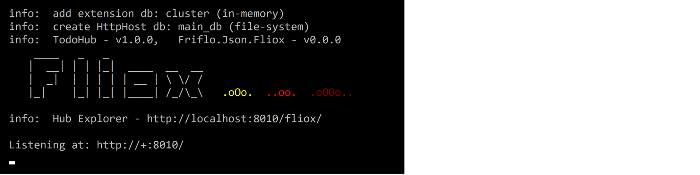
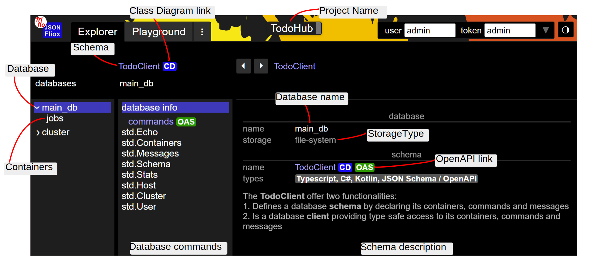
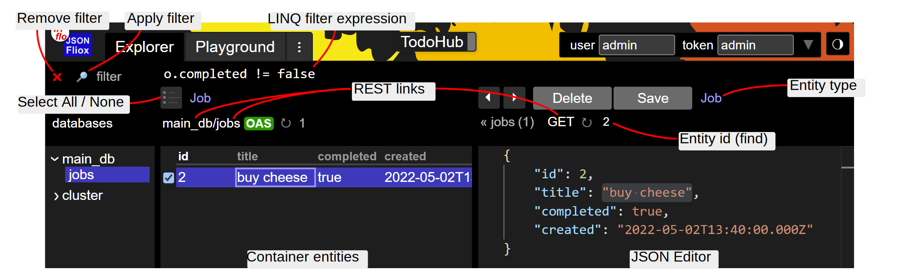

# [](https://github.com/friflo/Fliox.Examples)    **Fliox Examples**  

[](https://github.com/friflo/Fliox.Examples/actions)

<br/>


This project contains two **ready to run** examples showing how to create and use
[**JSON Fliox**](https://github.com/friflo/Friflo.Json.Fliox/blob/main/README.md) **Clients** & **Hubs**.  

*In short*  
**JSON Fliox** is .NET library supporting simple and efficient access to NoSQL databases via C# or Web clients.

This repo on GitHub: [friflo/Fliox.Examples](https://github.com/friflo/Fliox.Examples)

Published project on GitHub 2022-08

<br/>

# 🚩 Content

- [Examples](#-examples)
    - [Demo](#demo)
    - [Todo](#todo)
    - [SchemaValidation](#schemavalidation)
- [Build](#-build)
- [Walkthrough](#-walkthrough)
- [Credits](#-credits)

<br/><br/>


# 🚀 Examples

This project contains two examples with a different set of features. Their differences are listed at [🎨 Features](.docs/features.md).  
The intention is to guide how to add a new or remove an existing features in an application.

- [**Demo**](#demo)    *common* example  - LOC: 560
- [**Todo**](#todo)    *minimal* example - LOC:  70

Each example contains three folders / C# projects

| folder     | project type      | description               | run command                                           |
|------------|-------------------|---------------------------|-------------------------------------------------------|
| **Client** | .NET library      | database client / schema  |                                                       |
| **Hub**    | .NET HTTP server  | bootstrapping a Hub       | `dotnet run`                                          |
| **Test**   | NUnit tests       | client examples & test DB | `dotnet test` <br/> `dotnet run [http, file, memory]` |

The **API**'s used by the examples are available at [**fliox-docs API Reference**](https://github.com/friflo/fliox-docs)

Build, Test and Run instructions described at [🔧 Build](#-build)

<br/><br/>


## **Demo**
📄   [README.md](Demo)

The Demo example contains a *common* **Client**, a *common* **Hub** and **unit tests**.  

**Hub** features:  
All **Todo/Hub** features + **ASP.NET Core** integration, **GraphQL** API, monitoring, user authorization, **Pub-Sub**, container **relations** and custom **commands**.  
It utilize [Bogus](https://github.com/bchavez/Bogus) to generate fake records in various containers.

Use the Hub Explorer http://localhost:8010/fliox/ to check the features.  
Try out the online example [**DemoHub on AWS**](http://ec2-18-215-176-108.compute-1.amazonaws.com/) - *EC2: t2-micro*, *us-east-1*  

|              | Client                       | Hub                                                                    |
|--------------|------------------------------|------------------------------------------------------------------------|
| C#           | 2 files - LOC 130            | 4 files - LOC bootstrap 80, ASP.NET Core 70, domain examples 280       |
| dependencies | **JSON Fliox** 4 dlls 850 KB | **JSON Fliox** 7 dlls 900 KB  **GraphQLParser** 300kb  **Bogus** 2.4MB |

<br/><br/>


## **Todo**
📄   [README.md](Todo)

The Todo example contains a *minimal* **Client**, a *minimal* **Hub** and **unit tests**.  

**Hub** features:  
[**Hub Explorer**](https://github.com/friflo/Friflo.Json.Fliox/blob/main/Json/Fliox.Hub.Explorer/README.md),
HttpListener hosting, **REST / OpenAPI**, **Batch API** & **database schema**.  

Use the Hub Explorer http://localhost:8010/fliox/ to check the features.  

|              | Client                       | Hub                          |
|--------------|------------------------------|------------------------------|
| C#           | 1 file - LOC 30              | 1 file - LOC 40              |
| dependencies | **JSON Fliox** 4 dlls 850 KB | **JSON Fliox** 5 dlls 855 KB |

<br/><br/>


## **SchemaValidation**
📁   [C# Project](./SchemaValidation/)

### *JSON Schema validation*

The example shows how to validate a **JSON** string with a given **schema**.  
The input for `JsonValidator.Validate()` is the JSON string and the Type defining the schema - `Person` in the example below.  
Requires nuget package [Friflo.Json.Fliox ](https://www.nuget.org/packages/Friflo.Json.Fliox/).

```csharp
    class Person
    {
                    public  int     age;
        [Required]  public  string  name;
    }
    
    public static class SchemaValidation
    {
        /// Validate JSON with a Schema
        [Test]
        public static void Run() {
            var json = "{\"age\":42,\"name\":\"Peter\"}";
            var success = JsonValidator.Validate(json, typeof(Person), out var error);
            Assert.IsTrue(success);
        }
    }
```

### *Code generation*
The input for code generation is the type defining the schema - `Person` in the example below.  

```csharp
    /// Generate types for: C#, GraphQL, HTML, JSON Schema, Kotlin, Markdown and Typescript in folder: ./schema
    public static void GenerateSchemaModels() {
        var schemaModels = SchemaModel.GenerateSchemaModels(typeof(Person));
        foreach (var schemaModel in schemaModels) {
            var folder = $"./schema/{schemaModel.type}";
            schemaModel.WriteFiles(folder);
        }
    }
```

<br/><br/>


# 🔧 Build

The solution and its projects can be build, tested and executed on **Windows**, **Linux**, and **macOS**.  
It can be used with following IDE's:
[Visual Studio Code](https://code.visualstudio.com/),
[Rider](https://www.jetbrains.com/rider/) &
[Visual Studio 2022](https://visualstudio.microsoft.com/vs/).

*Note*: In order to build and run the examples the [**.NET 6.0 SDK**](https://dotnet.microsoft.com/en-us/download) is required.


Or use **Gitpod** to build and run the server using VSCode in the browser without installing anything.  
Workspace available in 30 sec. Open  <a href="https://gitpod.io/#https://github.com/friflo/Fliox.Examples" target="_blank">
  
</a>  in new tab. When Finished open Terminal panel.

<br/>

clone repository and open its directory - leave out this step when using Gitpod.
```cmd
git clone https://github.com/friflo/Fliox.Examples.git
cd Fliox.Examples
```

build all examples
```cmd
dotnet build
⏩
Build succeeded.
    0 Warning(s)
    0 Error(s)
```

run unit tests of all examples
```cmd
dotnet test
⏩
Passed! - Failed: 0, Passed: 7, Skipped: 0, Total: 7, Duration: 421 ms - TodoTest.dll (net6.0)
Passed! - Failed: 0, Passed: 6, Skipped: 0, Total: 6, Duration: 712 ms - DemoTest.dll (net6.0)
```

run a Hub as an HTTP server from its folder - e.g.
```cmd
cd ./Todo/Hub
dotnet run
```
the server will start with logs like




when using Gitpod:
- Click **Make Public**  
- Click **`http://localhost:8010/fliox/`**  in Terminal  


<br/>

Otherwise open the **Hub Explorer** in your browser: http://localhost:8010/fliox/

<br/>

run the .NET Test client accessing the Hub from its folder - e.g.
```cmd
cd ./Todo/Test
dotnet run
⏩
--- jobs:
id: 1, title: buy milk, completed: False
id: 2, title: buy cheese, completed: True

 wait for events ... (exit with: CTRL + C)
 note: generate events by clicking 'Save' on a record in the Hub Explorer
```
It will execute the client methods used in `Trial.Main()`

<br/><br/>

# 🐾 Walkthrough

Start with the simple **Todo** example as it contains only 70 LOC.  
Therefore execute the steps listed in [🔧 Build](./README.md#-build) section.

After starting the TodoHub server open the Hub Explorer at http://localhost:8010/fliox/ in the browser.  

<br/>



Now you can try the actions below in any order.
- Click on the **Project Name** to open the website describing the project
- Click on the **Schema** link to open a single page documentation
- Click on the **(CD) Class Diagram** link to open the database schema as a class diagram
- Click on the **(OAS) OpenAPI** link to open the Swagger UI
- Click on **Typescript, C#, Kotlin, JSON Schema / OpenAPI** link to export types for other languages
- Select a database command - e.g. **std.Echo** - and execute it with **Send**
- Select container **jobs** to view and edit its entities aka records  
  When selecting a container the UI will change shown in the screenshot below

<br/>



Use the container view to show, edit and query entities.
- Click on a **REST link** to show its response in a new browser tab
- Select an entity in the container (e.g. id: 1) to view its value in **JSON Editor**
- Make changes in the **JSON Editor** an **Save** them
- **Delete** selected entity / entities
- Create an new entity with the **JSON Editor** by
    - selecting an exiting one
    - change its id
    - click **Save**
- Execute a container query using a **LINQ filter expression**    `o => o.completed != false`  
  and clicking **Apply filter**
- Remove the query filter by clicking on the red ❌ on the top left in the Explorer
- **Select All / None** entities in the container to edit them as JSON

<br/>

**C# Tests**

The functionality shown in the Walkthrough above is also available via the C# API.  
How to use the API is demonstrated as unit tests in [TodoTests.cs](Todo/Test/TodoTests.cs) and [DemoTests](Demo/Test/DemoTests.cs).  
Use the **Test Explorer** of your **IDE** to execute and debug these tests.

<br/><br/>


# 🙏 Credits

|                                                             |             |                                                                |
| ----------------------------------------------------------- | ----------- | -------------------------------------------------------------- |
| [NUnit](https://nunit.org/)                                 | C#          | used for unit testing of the Examples                          |
| [Bogus](https://github.com/bchavez/Bogus)                   | C#          | to create Fake data by the DemoHub                             |
| [.NET platform](https://dotnet.microsoft.com/en-us/)        | C# .NET     | the platform providing compiler, runtime, IDE's & ASP.NET Core |
| [Swagger](https://swagger.io/)                              | static JS   | a REST / OpenAPI UI linked  by the Hub Explorer                |
| [GraphiQL](https://github.com/graphql/graphiql)             | static JS   | a GraphQL UI linked by the Hub Explorer                        |
| [Mermaid](https://github.com/mermaid-js/mermaid)            | static JS   | class diagram for database schema linked by the Hub Explorer   |
| [Monaco Editor](https://github.com/microsoft/monaco-editor) | static JS   | used as JSON Editor integrated in the Hub Explorer             |
| [Inscape](https://gitlab.com/inkscape/inkscape)             | Application | to create SVG's for this project                               |


<br/>

💖 *Like this project?*  
*Leave a* ⭐ at  [friflo/Fliox.Examples](https://github.com/friflo/Fliox.Examples)

Happy coding!  

<br/>

## License

This demo project is licensed under MIT.  
Published project on GitHub 2022-08  
Copyright © 2022   Ullrich Praetz
